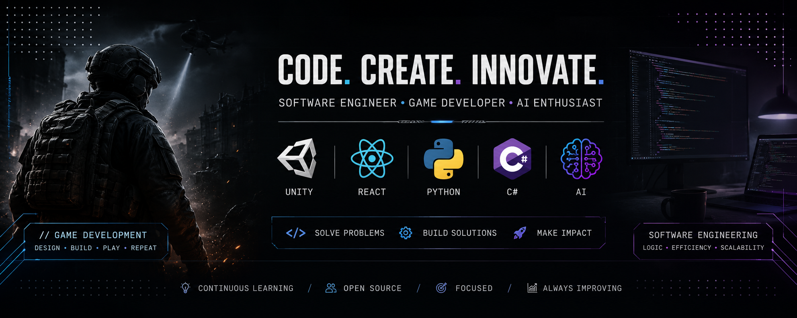

  

Hi, I'm Endy

Software Developer • Unity Game Developer • AI Enthusiast

I'm passionate about building high-quality software, immersive games, and AI-powered applications. I enjoy solving challenging problems and turning ideas into polished products.

Current Projects

Operation Revenant

Tactical third-person military shooter built with Unity.
Focused on modular architecture, advanced combat systems, and immersive gameplay.

Brotato Clone

Recreating Brotato from scratch in Unity to master gameplay systems and architecture.

TRADEXA

B2B Wholesale Marketplace designed for wholesalers and retailers.
Includes inventory optimization, supplier management, logistics, and analytics.

MediaOrbit

Movie & TV recommendation platform built using React, Flask, and the TMDB API.
 Tech Stack

Languages

C#
JavaScript
Python
HTML
CSS

Frameworks

React
Flask
Unity

Tools

Git
GitHub
MongoDB
Blender
VS Code
Unity
Ollama

 Currently Learning
Advanced Unity Architecture
Multiplayer Systems
AI Agents
Computer Graphics
 Reach Me

GitHub:
github.com/blaiz454
